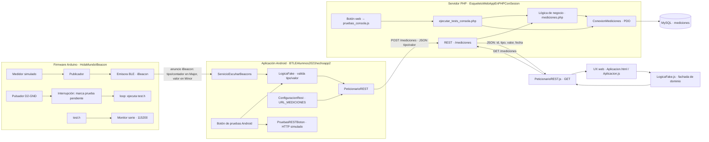

# Proyecto de biometría y medio ambiente

## Objetivo

El proyecto recoge mediciones de CO2 y temperatura. El firmware Arduino prepara y anuncia una medida mediante Bluetooth BLE. La aplicación Android escucha esos anuncios y envía las medidas aceptadas al servidor PHP. El servidor valida los datos y los guarda en MySQL. La página web consulta `GET /mediciones` y representa los valores recibidos.

## Carpetas

| Carpeta | Contenido |
|---|---|
| `HolaMundoIBeacon` | Sketch Arduino, clases BLE, medidor simulado y pruebas manuales en `test.h`. |
| `BTLEAlumnos2021hechoapp2` | Proyecto Android: permisos Bluetooth, escucha de beacons, lógica fake, cliente REST y botón para pruebas Android. |
| `EsqueletoWebAppEnPHPConSesion` | Aplicación web, API REST PHP, lógica de negocio, conexión PDO, SQL y pruebas web/PHP. |
| `doc` | Diseños y correspondencia entre los diseños y sus archivos de implementación. |
| `author.md` | Autoría del proyecto. |

## Recorrido de una medición

1. Arduino genera una lectura simulada de CO2 o temperatura.
2. `Publicador` codifica el tipo y el valor en los campos Major y Minor del anuncio iBeacon.
3. `ServicioEscuharBeacons` en Android analiza el anuncio y extrae tipo, contador y valor.
4. `LogicaFake` comprueba tipo y valor; `PeticionarioREST` envía `POST /mediciones` con JSON `{ "tipo": "CO2", "valor": 500 }`.
5. `src/rest/mediciones.php` valida el método y el cuerpo, delega en la lógica PHP y responde HTTP 201 si se guarda.
6. La web pide `GET /mediciones`. La respuesta es una lista con `id`, `tipo`, `valor` y `fecha`; el servidor genera `id` y `fecha`.

Los tipos admitidos son `CO2` y `TEMPERATURA`. Los valores deben ser números finitos. La tabla está definida en `EsqueletoWebAppEnPHPConSesion/bbdd/Estructura.sql`.

## Arquitectura completa

El proyecto se organiza en capas. Arduino produce anuncios BLE; Android los consume y actúa como cliente de escritura; el servidor PHP centraliza la validación HTTP, las reglas de negocio y el acceso a MySQL; la web actúa como cliente de consulta y presenta los datos. Arduino y Android se comunican por Bluetooth, Android y el servidor por HTTP, y la página web y el servidor también por HTTP.



### Responsabilidad de cada capa

| Capa | Responsabilidad | Entrada y salida |
|---|---|---|
| Firmware Arduino | Simula CO2/temperatura, incrementa el contador, codifica los campos iBeacon y los anuncia por BLE. Atiende el botón de pruebas sin ejecutar trabajo dentro de la interrupción. | Valores simulados → anuncio BLE; pulsación → resultado por Serial. |
| Escucha Android | Mantiene un servicio en primer plano, escanea BLE, valida la trama y extrae tipo, contador y valor. | Anuncio BLE → valores interpretados. |
| Lógica fake Android | Rechaza tipos no admitidos y valores no finitos antes del envío. No guarda una lista local ni devuelve un booleano de almacenamiento. | Tipo y valor → validación o excepción. |
| Cliente REST Android | Construye el JSON de alta y hace la petición HTTP de forma asíncrona. | `POST /mediciones` con `tipo`/`valor`; recibe código y cuerpo HTTP. |
| API REST PHP | Resuelve la ruta, método, JSON, códigos HTTP y formato de respuesta. | GET devuelve una lista; POST válido devuelve HTTP 201; maneja OPTIONS, 400, 405, 422 y 500 según el caso. |
| Lógica PHP | Valida el tipo y el número, guarda y consulta usando consultas preparadas. | Entrada de alta `(tipo, valor)`; consulta devuelve filas normalizadas. |
| Conexión PDO | Selecciona la configuración de producción o pruebas y abre conexión MySQL. | Entorno/configuración → `PDO`. |
| Base MySQL | Mantiene la tabla `mediciones`; asigna `id` autoincremental y `fecha` por defecto. | Columnas `id`, `tipo`, `valor`, `fecha`. |
| Cliente REST web | Ejecuta GET, analiza JSON y comunica errores HTTP o de red. | `/mediciones` → lista de mediciones. |
| UX web | Muestra las mediciones y los estados de carga/error; proporciona el botón que activa las pruebas. | Lista y estado de petición → contenido visible. |

### Contratos de comunicación

| Enlace | Contrato |
|---|---|
| Arduino → Android | Anuncio iBeacon BLE. El código del tipo y el contador se empaquetan en `Major`; el valor se envía en `Minor`. Android debe interpretar las mismas posiciones y bytes. |
| Android → REST | `POST /mediciones`, `Content-Type: application/json`, cuerpo `{ "tipo": "CO2", "valor": 500 }`. La respuesta de alta correcta es HTTP 201. |
| Web → REST | `GET /mediciones`. La respuesta es un arreglo JSON de `{ "id": número, "tipo": texto, "valor": número, "fecha": fecha }`. |
| REST → lógica PHP | POST delega en `guardarMediciones(tipo, valor)`; GET delega en `mostrarMediciones()`. |
| Lógica PHP → MySQL | PDO y sentencias preparadas para altas y consultas. El servidor genera `id` y `fecha`. |

### Límites y configuración

- El firmware actual usa lecturas simuladas (`CO2 = 18`, `TEMPERATURA = 8`); la arquitectura aún no representa la lectura calibrada de un sensor físico.
- Android configura el destino en `ConfiguracionRest.URL_MEDICIONES`. El móvil debe alcanzar esa URL por red.
- PHP elige producción por defecto. Las pruebas web exigen `MEDICIONES_ENTORNO=pruebas` y credenciales de una base de pruebas independiente.
- Las pruebas Android usan conexiones HTTP simuladas. Las pruebas web simulan el cliente en JavaScript y, para la parte PHP, usan MySQL de pruebas. Arduino comprueba sus valores simulados y escribe en Serial.
- La página y la API comparten el origen en la configuración esperada para que las peticiones del navegador y el endpoint de pruebas respeten same-origin.

### Estructura por componentes

```text
HolaMundoIBeacon/
  HolaMundoIBeacon.ino       Coordinación, setup/loop y botón físico
  Medidor.h                  Valores de medida simulados
  Publicador.h               Empaquetado y publicación de mediciones
  EmisoraBLE.h               Adaptador Bluefruit/iBeacon
  LED.h, PuertoSerie.h       Salidas de apoyo
  test.h                     Pruebas manuales del firmware

BTLEAlumnos2021hechoapp2/app/src/main/
  java/.../MainActivity.java             Pantalla, permisos y botón de pruebas
  java/.../ServicioEscuharBeacons.java   Servicio de escaneo BLE
  java/.../TramaIBeacon.java             Interpretación de trama
  java/.../LogicaFake.java               Validación de tipo y valor
  java/.../PeticionarioREST.java         Cliente HTTP Android
  java/.../PruebasRESTBoton.java         REST simulado para pruebas manuales
  java/.../ConfiguracionRest.java        URL del servidor

EsqueletoWebAppEnPHPConSesion/
  src/rest/mediciones.php                Endpoint GET/POST /mediciones
  src/logica/mediciones.php               Reglas e interacción de mediciones
  src/BBDD/ConexionMediciones.php         Selección de entorno y PDO
  src/logicaFake/LogicaFake.js             Fachada de dominio para la UX web
  src/logicaFake/PeticionarioREST.js       Adaptador HTTP GET web
  src/ux/Aplicacion.html y Aplicacion.js  Interfaz web
  src/tests/                              Pruebas web, PHP, REST y BD
  bbdd/Estructura.sql                     Esquema MySQL
```

## Preparar MySQL y PHP

1. Crea una base de datos MySQL para el proyecto.
2. Ejecuta `EsqueletoWebAppEnPHPConSesion/bbdd/Estructura.sql` sobre esa base. El script crea la tabla `mediciones` con las columnas `id`, `tipo`, `valor` y `fecha`.
3. Opcionalmente, ejecuta `EsqueletoWebAppEnPHPConSesion/bbdd/datos.sql` para insertar datos de ejemplo.
4. Para desarrollo local, configura PHP con PDO MySQL y sirve la carpeta `EsqueletoWebAppEnPHPConSesion` desde Apache o un servidor PHP compatible. En Apache se usa `.htaccess` para resolver `/mediciones` hacia el endpoint REST.
5. La ruta pública que consumen Android y la web es `/mediciones`: GET consulta y POST guarda.

### Configurar las credenciales de producción

En `EsqueletoWebAppEnPHPConSesion/src/BBDD/ConfiguracionProduccion.txt` está la plantilla informativa de configuración. El servidor **no lee** ese TXT: sirve para recordar los campos que hay que poner en el archivo local ignorado por Git `ConfiguracionProduccion.php`, dentro de la misma carpeta `src/BBDD`.

Crea `EsqueletoWebAppEnPHPConSesion/src/BBDD/ConfiguracionProduccion.php` con esta forma y sustituye los valores de ejemplo:

```php
<?php
return [
    'host' => 'HOST_MYSQL',
    'base' => 'NOMBRE_BASE',
    'usuario' => 'USUARIO_MYSQL',
    'password' => 'CONTRASENA_MYSQL'
];
```

El archivo PHP no se incluye en el repositorio porque contiene credenciales. Créalo también en el servidor de publicación. No escribas claves reales en el TXT de plantilla ni en archivos públicos. Para producción, se permite también obtener valores de variables de entorno `MEDICIONES_DB_HOST_PROD`, `MEDICIONES_DB_NAME_PROD`, `MEDICIONES_DB_USER_PROD` y `MEDICIONES_DB_PASSWORD_PROD`.

## Firmware Arduino

1. Abre `HolaMundoIBeacon/HolaMundoIBeacon.ino` con Arduino IDE.
2. Selecciona la placa usada por el montaje y asegúrate de tener instalada la librería Bluefruit requerida por el código.
3. Compila y carga el sketch. En el arranque inicializa el puerto serie, el LED y la emisora; después publica beacons de forma periódica. El medidor actual genera valores simulados, no lee un sensor físico calibrado.
4. Para ejecutar las pruebas manuales, conecta un pulsador entre D2 y GND. Abre el monitor serie a 115200 baudios y pulsa el botón físico. La interrupción registra la pulsación; `loop()` ejecuta después `test.h` y muestra los resultados por Serial. No se activan automáticamente al encender.

## Aplicación Android

1. Abre `BTLEAlumnos2021hechoapp2` con Android Studio y espera a que Gradle termine de sincronizar.
2. Revisa `app/src/main/java/com/example/ldiamur/btlealumnos2021app/ConfiguracionRest.java`. `URL_MEDICIONES` debe apuntar al servidor y terminar en `/mediciones`; usa una dirección alcanzable desde el dispositivo. En un móvil físico, `localhost` apunta al móvil, no al ordenador que ejecuta Apache.
3. Ejecuta la aplicación en un dispositivo Android con Bluetooth BLE. Concede los permisos solicitados para escanear/conectar por Bluetooth y, en las versiones correspondientes, notificaciones/localización.
4. Para comprobar la lógica y el cliente REST simulado, pulsa **Ejecutar todas las pruebas**. Las pruebas no se ejecutan al iniciar la aplicación. En Logcat filtra por `TESTS_APP`, `TEST_LOGICAFake` o `TEST_PETICIONARIO_REST` para ver inicio, casos y resumen.
5. Para iniciar la escucha BLE, utiliza los botones de búsqueda de la aplicación; para acabarla, pulsa detener. Una medición real que supere la validación se envía al servidor configurado.

Las pruebas REST del botón usan conexiones simuladas para probar GET, POST, respuesta HTTP 201 y error HTTP. No insertan datos en MySQL ni necesitan `MockWebServer` o dependencias Gradle de pruebas externas.

## Web

1. Publica `EsqueletoWebAppEnPHPConSesion` en el servidor web.
2. Configura PHP y PDO MySQL, la base de datos y el archivo local `src/BBDD/ConfiguracionProduccion.php`.
3. Abre `src/ux/Aplicacion.html` desde el servidor. La página consulta `/mediciones` para obtener las filas y actualiza su contenido.
4. Para ejecutar las pruebas, pulsa el botón **Ejecutar pruebas** de la página. No se ejecutan al abrirla.
5. Abre las herramientas de desarrollo del navegador y selecciona **Consola**. Allí aparece `EJECUTAR TESTS`, el resultado de cada caso y el bloque `RESULTADOS :` con los grupos y sus recuentos.

El botón ejecuta pruebas del cliente REST web con respuestas simuladas, la fachada de lógica frontend, la presentación de carga/éxito/error, la lógica PHP, el endpoint REST y la conexión/esquema de base de datos. Los grupos de lógica, REST y BD requieren conexión a una base exclusiva de pruebas.

### Base de datos exclusiva para pruebas web

La batería PHP elimina filas de `mediciones` al principio y al final. **No la configures con la base de datos de producción ni con una base que contenga datos que quieras conservar.** Crea una base separada, aplica `bbdd/Estructura.sql` y configura el servidor con:

```text
MEDICIONES_ENTORNO=pruebas
MEDICIONES_DB_HOST_TEST=host_de_pruebas
MEDICIONES_DB_NAME_TEST=nombre_base_de_pruebas
MEDICIONES_DB_USER_TEST=usuario_de_pruebas
MEDICIONES_DB_PASSWORD_TEST=contrasena_de_pruebas
```

La ruta web `src/tests/ejecutar_tests_consola.php` solo admite POST del mismo origen y exige `MEDICIONES_ENTORNO=pruebas`. Al ejecutarse, confirma que la tabla empieza vacía, que existe el esquema esperado, inserta datos de prueba, comprueba lógica y REST y limpia las filas al terminar. Los errores de configuración o de conexión aparecen como casos `ERROR` en la consola.

También existen `src/tests/probar_base_datos.php` y `src/tests/probar_rest.php` para ejecutar esas comprobaciones PHP por separado desde un entorno que tenga PHP CLI y acceso a MySQL. Usan igualmente la base exclusiva de pruebas y borran filas antes y después. `probar_peticionario_rest.js` y `probar_ux.js` contienen casos JavaScript equivalentes a los incluidos en el botón de la web.

## Diseños

Los documentos de diseño están en `doc`:

| Documento | Qué describe |
|---|---|
| [`system_design.md`](doc/system_design.md) | Arquitectura, responsabilidades, secuencias de alta/consulta, límites y contratos entre capas. |
| [`component_map.md`](doc/component_map.md) | Correspondencia de cada diseño con los archivos fuente. |
| [`arduino_design.md`](doc/arduino_design.md) | Ciclo del firmware, codificación iBeacon, clases y pulsador de pruebas. |
| [`android_design.md`](doc/android_design.md) | Permisos, escaneo BLE, validación, cliente REST y clases Android. |
| [`web_rest_design.md`](doc/web_rest_design.md) | Endpoint `/mediciones`, métodos, respuestas HTTP y errores. |
| [`communication_design.md`](doc/communication_design.md) | Contrato formal de comunicación HTTP separado de la lógica del backend. |
| [`business_logic_design.md`](doc/business_logic_design.md) | Reglas de negocio independientes de HTTP y alineadas con `mediciones`. |
| [`web_logic_design.md`](doc/web_logic_design.md) | Validación, inserción, consultas y normalización PHP. |
| [`frontend_business_logic_design.md`](doc/frontend_business_logic_design.md) | Contrato de dominio del frontend web y paridad con las operaciones de negocio. |
| [`web_rest_client_design.md`](doc/web_rest_client_design.md) | Adaptador HTTP GET del navegador y manejo de JSON/errores. |
| [`web_ux_design.md`](doc/web_ux_design.md) | Tabla, estados, refresco periódico y funciones de la interfaz. |
| [`database_connection_design.md`](doc/database_connection_design.md) | Entornos, credenciales y creación de conexiones PDO. |
| [`database_design.md`](doc/database_design.md) | Tabla, columnas, reglas y ciclo de vida de cada medición. |
| [`tests_design.md`](doc/tests_design.md) | Activación manual, casos, resultados, requisitos y efectos de cada batería. |

Los documentos incluyen las firmas de las funciones y una explicación de su propósito. En diagramas de clase, los miembros privados permanecen dentro de la caja y las operaciones públicas se conectan por una abertura del borde, según la convención indicada en los diseños.
