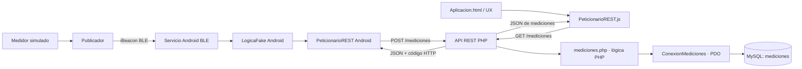

# Diseño de arquitectura del proyecto

## Component Design

El sistema está formado por firmware BLE, aplicación Android, API REST PHP, lógica de negocio, adaptadores de conexión MySQL, cliente REST web y UX. El firmware publica medidas; Android las recibe y valida antes de enviarlas por HTTP; el servidor valida y persiste; la web consulta y presenta lecturas.

### Contratos principales

- Firmware → Android: trama iBeacon con tipo/contador en Major y valor en Minor.
- Android → API: POST JSON `{ "tipo": Text, "valor": R }`.
- Web → API: GET JSON `[ (id: N, tipo: Text, valor: R, fecha: DateTime) ]`.
- API → lógica → conexión PDO → base MySQL.

### Vista general de arquitectura

### Componentes y responsabilidades

| Componente | Responsabilidad y límite |
|---|---|
| Firmware | Simula lecturas y publica campos de medida por BLE. No conoce HTTP ni MySQL. |
| Servicio Android | Mantiene el escaneo BLE, interpreta el anuncio y evita volver a enviar el mismo tipo/contador. |
| Lógica fake Android | Valida tipo y valor antes de usar el cliente REST; no mantiene una base local. |
| Cliente REST Android | Envía altas mediante POST asíncrono y devuelve estado/cuerpo por callback. |
| Endpoint PHP | Traduce método/cuerpo HTTP a códigos y operaciones de lógica. No contiene SQL de negocio. |
| Lógica PHP | Valida entrada, consulta/guarda mediciones y normaliza el resultado. |
| Adaptador PDO | Resuelve credenciales por entorno y abre conexiones a MySQL. |
| Cliente REST web | Consulta GET, analiza JSON y transforma fallos HTTP/red en errores. |
| UX web | Presenta la lista de mediciones, estados de carga/error y el botón manual de pruebas. |
| Pruebas | Se activan manualmente por botón o pulsador. Las pruebas de servidor usan una base de pruebas aislada. |

### Secuencia de alta desde el beacon

1. `setup()` inicializa serie, botón, emisora y medidor. `loop()` alterna medidas de CO2 y temperatura y las publica.
2. `Publicador` empaqueta el tipo y contador en Major y el valor en Minor.
3. Android recibe el anuncio, comprueba que sea una trama válida, y extrae tipo, valor y contador.
4. `enviarMedicionNueva` descarta un anuncio repetido del mismo tipo y contador.
5. `LogicaFake.guardarMediciones` valida tipo CO2/TEMPERATURA y valor finito.
6. `PeticionarioREST.enviarMedicion` crea el JSON y hace POST a la URL configurada.
7. El endpoint valida JSON y método, luego delega a la lógica PHP.
8. La lógica selecciona PDO, prepara el INSERT y MySQL genera `id` y `fecha`.
9. La API responde 201 cuando el alta acaba correctamente; Android registra el estado HTTP.

### Secuencia de consulta web

1. `Aplicacion.html` carga la UX y `iniciarAplicacion()` realiza una consulta inicial; después programa la actualización cada cinco segundos.
2. `actualizarMediciones()` muestra estado de carga y llama a `pedirMediciones()`.
3. El cliente solicita GET `/mediciones`, valida el estado HTTP y analiza la respuesta JSON.
4. El endpoint delega la lectura a `mostrarMediciones()`, que consulta MySQL y normaliza filas.
5. La UX muestra las mediciones recibidas (hasta las diez más recientes) o el estado de error.

### Límites y fallos

- BLE, HTTP y PDO son fronteras distintas. Cada capa comunica datos mediante el contrato descrito; las capas superiores no ejecutan SQL directamente.
- Una ruta o cuerpo HTTP inválidos se distinguen de errores de validación y errores internos mediante códigos HTTP.
- La URL REST y las credenciales viven en configuraciones separadas. Las credenciales de producción no deben versionarse.
- Las lecturas de firmware actuales son simuladas, por lo que una medición guardada demuestra el flujo de software, no una medición física validada.
- Las pruebas que limpian la tabla solo deben usar la base de datos exclusiva de pruebas.

## Design Clarifications

La carpeta `EsqueletoWebAppEnPHPConSesion` es la raíz del servidor web dentro de este repositorio; sus subcarpetas `src/rest`, `src/logica`, `src/BBDD` y `src/ux` corresponden a componentes distintos. Android tiene su propia raíz y ciclo de compilación.

## General Rules

- **Programming Language:** C++/Arduino, Java, PHP, JavaScript, HTML/CSS y SQL según el componente.
- **Function/Method Headers:** Cada cabecera debe incluir el diseño lógico en un bloque de comentario delimitado por líneas `--------------------`.
- **Code Readability:** Código claro y autoexplicativo; comentarios inline mínimos.
- **Automated Testing:** Generar pruebas unitarias/de integración para métodos críticos en cada componente.
